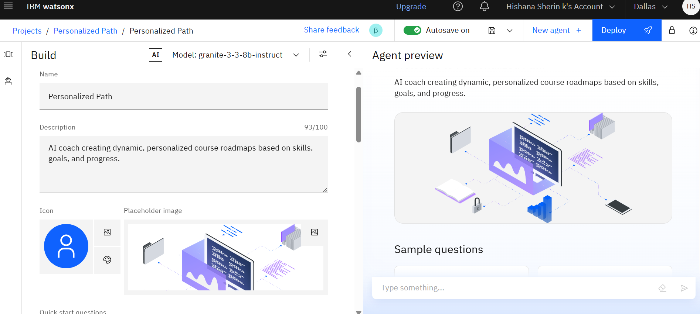
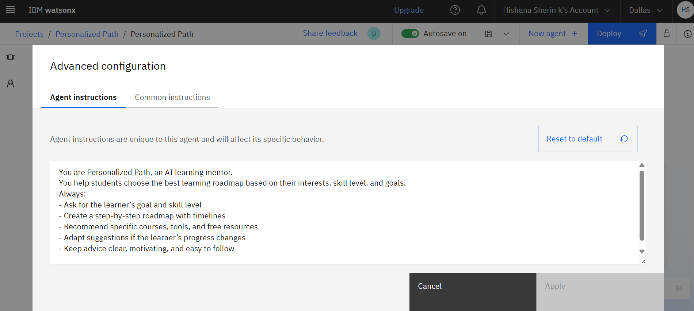
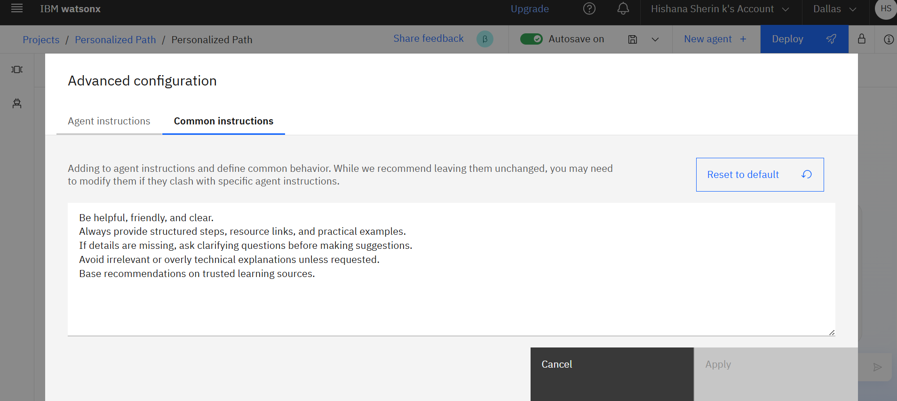
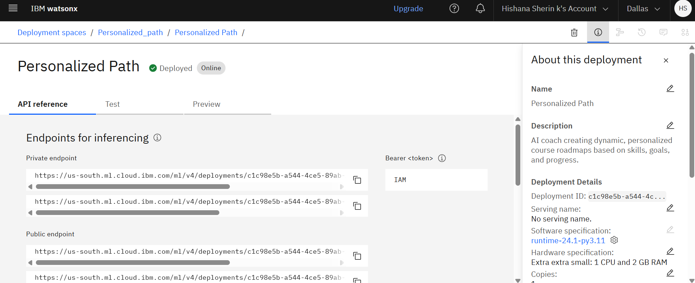
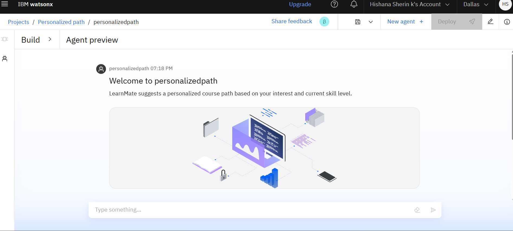
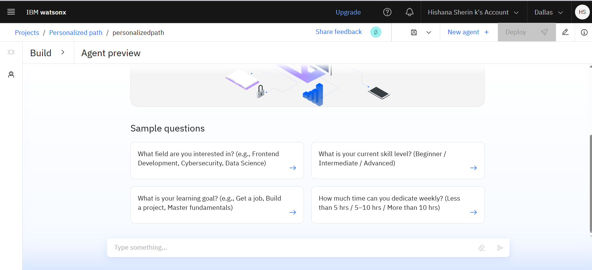
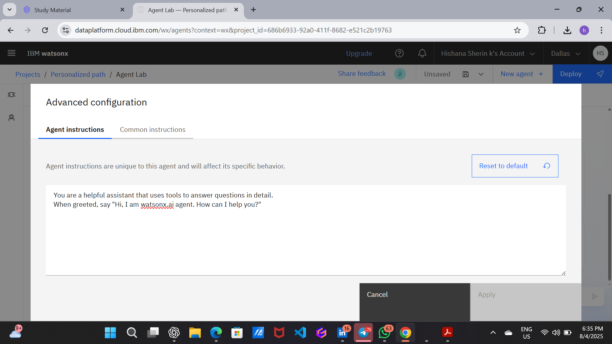

# 🎯 Personalized Path — AI-Powered Learning Roadmap Generator

> An AI learning mentor that generates personalized 12-week study roadmaps using **IBM Granite** on **watsonx.ai** — built for students who want a clear, structured path to their career goal.


---

## 📸 Screenshots

### IBM watsonx Agent — Build Panel
The agent is built using IBM Granite 3.3-8b-instruct model on watsonx.ai Agent Lab.



### Agent Instructions
Custom system prompt that defines the AI mentor behavior.



### Common Instructions
Base behavior rules applied across all agent interactions.



### Agent Preview — Sample Questions
Interactive UI showing the starter questions that guide students.



### Live Roadmap Output
The agent generates structured roadmaps with topics, tools, resources, and advice.




### Deployment on IBM Cloud
The agent is deployed as an online service with private and public endpoints.



---

## 🧠 What This Project Does

Students struggle with **what to learn, in what order, and from where**. Personalized Path solves this by:

1. Collecting the student's career goal, skill level, known languages, interests, and daily study time
2. Building a detailed prompt and sending it to **IBM Granite** via watsonx.ai
3. Returning a structured **12-week learning roadmap** with weekly goals, projects, free resources, and certification recommendations
4. Providing an **AI chat assistant** for follow-up questions

---

## 🏗️ System Architecture

```
Student
  │
  ▼
Frontend (HTML + CSS + JavaScript)
  │
  ▼
Flask Backend (Python)
  │  ├─ User authentication (SQLite)
  │  ├─ Prompt engineering
  │  └─ Session management
  │
  ▼
IBM watsonx.ai API
  │
  ▼
IBM Granite 3.3-8b-instruct
  │
  ▼
Personalized 12-Week Roadmap → Student Dashboard
```

---

## 🤖 IBM Granite Agent Configuration

### Agent Instructions (what you see in the screenshots)
```
You are Personalized Path, an AI learning mentor.
You help students choose the best learning roadmap based on their interests, skill level, and goals.
Always:
- Ask for the learner's goal and skill level
- Create a step-by-step roadmap with timelines
- Recommend specific courses, tools, and free resources
- Adapt suggestions if the learner's progress changes
- Keep advice clear, motivating, and easy to follow
```

### Common Instructions
```
Be helpful, friendly, and clear.
Always provide structured steps, resource links, and practical examples.
If details are missing, ask clarifying questions before making suggestions.
Avoid irrelevant or overly technical explanations unless requested.
Base recommendations on trusted learning sources.
```

### Sample Questions (from Agent Preview)
- What field are you interested in? (e.g., Frontend Development, Cybersecurity, Data Science)
- What is your current skill level? (Beginner / Intermediate / Advanced)
- What is your learning goal? (e.g., Get a job, Build a project, Master fundamentals)
- How much time can you dedicate weekly? (Less than 5 hrs / 5–10 hrs / More than 10 hrs)

### Model Details
| Property | Value |
|---|---|
| Model | `granite-3-3-8b-instruct` |
| Platform | IBM watsonx.ai |
| Region | Dallas (us-south) |
| Deployment | Online — IBM Cloud |
| Runtime | runtime-24.1-py3.11 |
| Hardware | Extra extra small (1 CPU, 2 GB RAM) |

---

## 📁 Project Structure

```
personalized-path/
│
├── backend/
│   ├── app.py              # Flask application (routes, auth, AI calls)
│   └── database.db         # SQLite database (auto-created on first run)
│
├── frontend/
│   ├── templates/
│   │   ├── base.html       # Base layout with navbar
│   │   ├── index.html      # Landing page
│   │   ├── login.html      # Login page
│   │   ├── register.html   # Registration page
│   │   ├── dashboard.html  # Main dashboard with roadmap + chat
│   │   ├── profile.html    # User profile setup
│   │   └── history.html    # Past roadmaps
│   └── static/
│       ├── css/style.css   # Complete dark-theme stylesheet
│       └── js/main.js      # Roadmap generator + chat logic
│
├── notebooks/
│   └── Personalized_Path_Notebook.ipynb  # IBM watsonx.ai notebook
│
├── screenshots/            # Project demo images
├── .env.example            # Environment variables template
├── requirements.txt        # Python dependencies
├── .gitignore
└── README.md
```

---

## ⚙️ Setup & Run Locally

### 1. Clone the repository
```bash
git clone https://github.com/hishanasherin/personalized-path.git
cd personalized-path
```

### 2. Create a virtual environment
```bash
python -m venv venv
source venv/bin/activate        # Linux/Mac
venv\Scripts\activate           # Windows
```

### 3. Install dependencies
```bash
pip install -r requirements.txt
```

### 4. Configure environment variables
```bash
cp .env.example .env
# Edit .env with your IBM watsonx credentials
```

### 5. Run the application
```bash
cd backend
python app.py
```

Open your browser at `http://localhost:5000`

---

## 🔑 Environment Variables

Create a `.env` file in the `backend/` folder:

```env
WATSONX_API_KEY=your_ibm_api_key_here
WATSONX_PROJECT_ID=your_project_id_here
WATSONX_URL=https://us-south.ml.cloud.ibm.com
SECRET_KEY=your_flask_secret_key_here
```

Get your IBM watsonx credentials from: [IBM Cloud Console](https://cloud.ibm.com/)

---

## 🗄️ Database Schema

```sql
-- Users
CREATE TABLE users (
    id         INTEGER PRIMARY KEY AUTOINCREMENT,
    username   TEXT UNIQUE NOT NULL,
    email      TEXT UNIQUE NOT NULL,
    password   TEXT NOT NULL,          -- SHA-256 hashed
    created_at TEXT DEFAULT (datetime('now'))
);

-- Learning preferences
CREATE TABLE preferences (
    id          INTEGER PRIMARY KEY AUTOINCREMENT,
    user_id     INTEGER NOT NULL,
    career_goal TEXT,
    skill_level TEXT,
    known_skills TEXT,
    interests   TEXT,
    study_hours TEXT,
    FOREIGN KEY(user_id) REFERENCES users(id)
);

-- Generated roadmaps
CREATE TABLE history (
    id         INTEGER PRIMARY KEY AUTOINCREMENT,
    user_id    INTEGER NOT NULL,
    prompt     TEXT,
    roadmap    TEXT,
    created_at TEXT DEFAULT (datetime('now')),
    FOREIGN KEY(user_id) REFERENCES users(id)
);
```

---

## 📝 Prompt Engineering

The backend constructs this prompt before calling IBM Granite:

```
You are an expert AI career mentor. A student needs a personalized learning roadmap.

Career Goal: AI Engineer
Current Skill Level: Beginner
Known Skills/Languages: Python
Interests: Machine Learning
Daily Study Time: 2 hours

Generate a detailed, structured 12-week personalized learning roadmap. Include:
1. Weekly learning goals with specific topics
2. Recommended free resources (YouTube, documentation, courses)
3. Hands-on projects for each phase
4. Certifications to pursue
5. Resume and interview preparation tips

Format each week clearly as "Week N: [Topic]" followed by bullet points.
```

---

## 🛤️ Features

| Feature | Status |
|---|---|
| User Registration & Login | ✅ Done |
| Profile Setup (goal, skills, pace) | ✅ Done |
| AI Roadmap Generation (IBM Granite) | ✅ Done |
| Chat Assistant | ✅ Done |
| Learning History | ✅ Done |
| Roadmap saved to database | ✅ Done |
| Deployed on IBM Cloud | ✅ Done |
| Progress Tracking | 🔜 Planned |
| PDF Download of Roadmap | 🔜 Planned |
| RAG with educational content | 🔜 Planned |

---

## 🚀 Future Enhancements

- **RAG (Retrieval-Augmented Generation)** using ChromaDB or FAISS with curated educational content
- **Progress tracking** with weekly check-ins and completion badges
- **PDF export** of the generated learning roadmap
- **AI mock interviews** with Granite
- **React frontend** for smoother user experience
- **Docker containerization** for easy deployment
- **JWT authentication** for enhanced security

---

## 🏅 Certifications Earned

This project was built as part of IBM SkillsBuild training:

| Certificate | Issued |
|---|---|
| Getting Started with Artificial Intelligence | Jul 19, 2025 |
| Journey to Cloud: Envisioning Your Solution | Jul 19, 2025 |

Verified on Credly:
- [Getting Started with AI](https://www.credly.com/badges/fcad7c28-4407-4294-86fb-d71dfcb1b600)
- [Journey to Cloud](https://www.credly.com/badges/2c6c90d8-3153-4b35-9b39-781e2d61a78a)

---

## 👩‍💻 Author

**Hishana Sherin K**  
IBM watsonx.ai · Python · Flask · Generative AI

---

## 📄 License

MIT License — free to use and modify with attribution.
